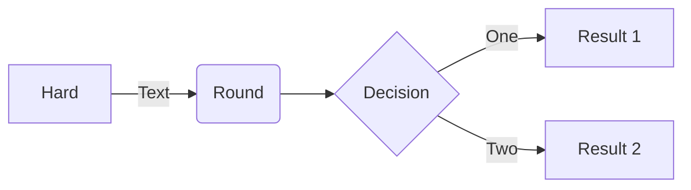

# throwawayrepo
This is a throwaway repo

Add a new line

This is with tt: <tt>foo</tt>

This is with code: <code>foo</code>

This is with backtick: `foo`

This is with texttt: $\texttt{foo}$

This is in a math-block:

```math
\left( \sum_{k=1}^n a_k b_k \right)^2 \leq \left( \sum_{k=1}^n a_k^2 \right) \left( \sum_{k=1}^n b_k^2 \right)
```

```math
\sqrt{3}
```


